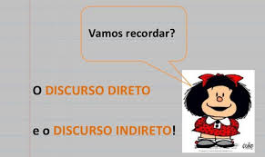
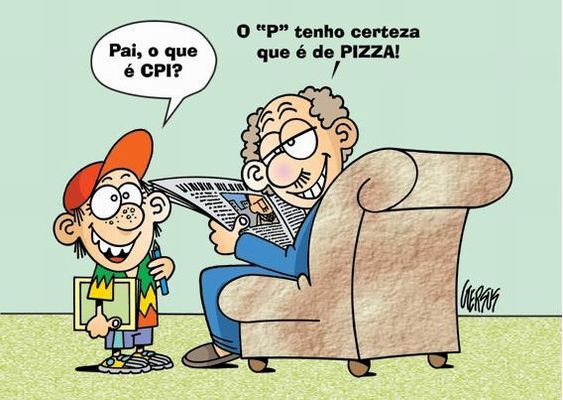
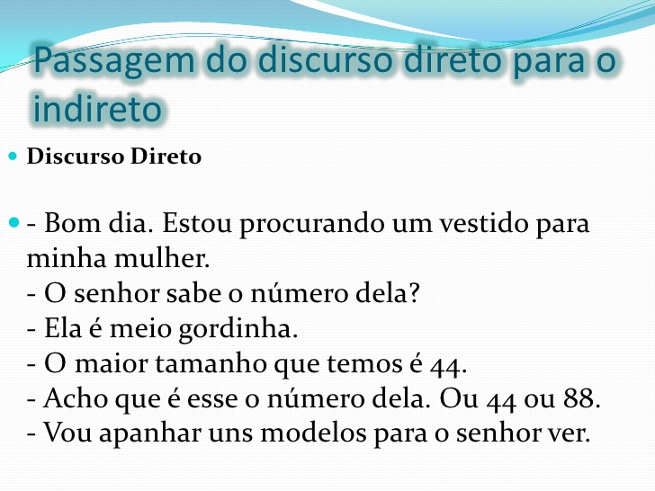
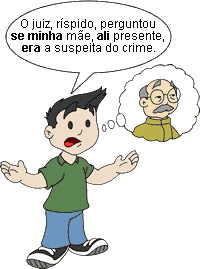

# Discurso Direto x Discurso Indireto

* O uso dos discursos é inerente ao texto narrativo. O seu conhecimento torna-se importante para que o leitor entenda a forma como o texto é levado, e assim pode ambientar a sua leitura.

# Discurso Direto

No Discurso Direto, o autor realiza uma transcrição fiel da fala de um personagem.

# Discurso Indireto

No Discurso Indireto, existe um elemento narrador, responsável por contar da sua forma como uma outra personagem opinou ou se expressou sobre alguma coisa.

# Author

* Rodrigo C. C. L. B. Leal